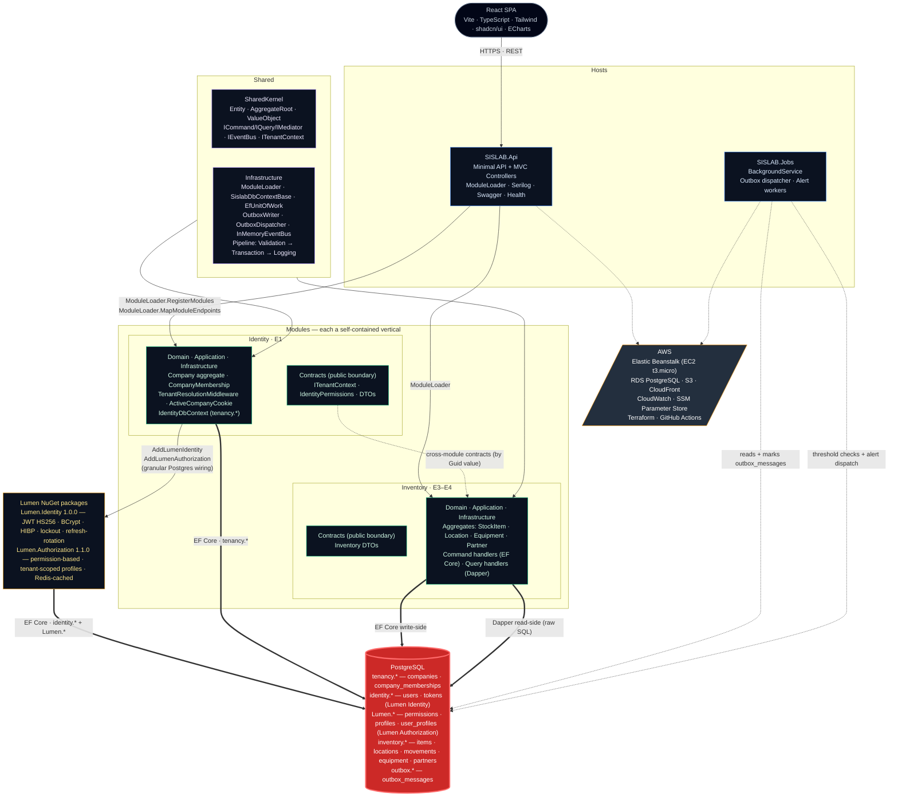

<h1 align="center">SISLAB</h1>

<p align="center">
  <i>Multi-tenant laboratory management platform — .NET 8 modular monolith (DDD · CQRS · Outbox) consuming IAM as a NuGet library (Lumen), with a React + ECharts SPA and production infrastructure on AWS managed by Terraform.</i>
</p>

<p align="center">
  <a href="https://github.com/KauaVilasBoas/SISLAB/actions/workflows/ci.yml">
    
  </a>
  
  
  
  <a href="https://www.conventionalcommits.org/">
    
  </a>
  <a href="LICENSE">
    
  </a>
</p>

---

## What is this?

Most laboratories run their inventory, equipment, and partners on spreadsheets — and every
limitation that comes with that: no real-time stock level, no low-quantity alerts, no audit trail,
no concurrent access, no permission management. **SISLAB** replaces that with a production-grade
web platform built from day one for **multi-tenancy**: a single installation serves multiple
companies (laboratories), each operating in complete data isolation.

The pilot client is **LAFTE** (a real laboratory). The MVP delivers full inventory control —
stock entries, consumption, transfers between storage locations (storeroom, freezer, controlled
substances cabinet), equipment management, partner (supplier/client) records, expiry and low-stock
alerts, and an analytics dashboard — with an audit trail for future regulatory compliance.

Identity and access management are delegated to **[Lumen](https://github.com/KauaVilasBoas/Lumen)**,
a purpose-built IAM service consumed here as NuGet packages (`Lumen.Identity 1.0.0` + `Lumen.Authorization 1.1.0`).
Multi-tenancy is a SISLAB responsibility: a user can belong to multiple companies, switching
active company without re-authenticating; their permissions are scoped per company.

### Highlights

- **Multi-tenancy in depth** — active company lives in an httpOnly cookie (not the JWT), validated
  per-request against `company_memberships` in the DB. `companyId` flows: cookie → middleware →
  `ITenantContext` → EF Core global query filter → `WHERE company_id` in every Dapper query.
  Defense in depth: the cookie alone is never trusted.
- **IAM as a NuGet** — Lumen provides JWT authentication (BCrypt, HIBP k-anonymity, lockout,
  refresh-token rotation) and permission-based authorization (`[RequirePermission]`, profiles
  with tenant-scoped assignments). SISLAB wires both granularly against PostgreSQL — the Lumen
  umbrella DI method registers SQL Server migrations; SISLAB composes individually.
- **Dual persistence — right tool per use case** — write-side uses EF Core (aggregates, invariants,
  transactions); read-side uses Dapper with raw SQL in the Branef.SGF pattern (query + handler +
  result sealed in one file). Zero ORM overhead on reads.
- **Hybrid event strategy** — transactional handlers dispatch in-transaction (failure = rollback)
  for genuine business invariants; side effects (cross-module integration events) go through the
  Outbox in the same transaction and are dispatched eventually by the Jobs worker.
- **Boundary enforcement by tests** — ArchUnitNET rules fail the build the moment a module
  references another module's internals; only `*.Contracts` assemblies may cross a boundary.
- **One schema per bounded context** — `tenancy.*`, `identity.*` (Lumen), `Lumen.*` (Lumen.Authorization),
  `inventory.*`, `outbox.*`. Each context owns its migrations, applied at startup by hosted services.
  No cross-schema foreign keys — cross-references are by `Guid` value.
- **Permission-based authorization with tenant scope** — the same user can be an `Administrator`
  in company A and have no profile in company B. Authorization is verified per-request against the
  active company, cached by `(userId, companyId)`, and effective immediately on profile changes.

---

## Architecture at a glance



<sub><b>Reading the diagram</b> — both hosts compose modules through <code>ModuleLoader</code> (assembly-scan auto-discovery); thick arrows are EF Core / Dapper I/O paths; dashed arrows are module wiring, contract dependencies and background-worker access. Each module is a self-contained vertical (green) — the only thing they share is the other module's <b>Contracts</b> assembly, never its internals. Lumen packages (amber) own the IAM schemas entirely; SISLAB never reaches into them. <code>tenancy.*</code> is SISLAB's own schema for multi-tenancy — separate from Lumen's <code>identity.*</code> to avoid DbContext collisions.</sub>

---

## Engineering decisions

Each decision below was planned as a card on the
[Trello board](https://trello.com/b/C8qhOb3j/sislab) and the larger ones have an ADR.

| Decision | Rationale |
|---|---|
| **Active company in cookie, not JWT** | A claim in the JWT is frozen at issue time — switching companies would require a new login. An httpOnly + SameSite cookie holds the active `companyId`; the `TenantResolutionMiddleware` re-validates membership against the DB on every request. Company switch = new cookie, same token. The trade-off: one extra DB read per request, eliminated in E9 with per-request caching. |
| **IAM as NuGet packages** | SISLAB delegates authentication and authorization to **Lumen**, consumed as `Lumen.Identity 1.0.0` + `Lumen.Authorization 2.0.0`. SISLAB owns tenancy (`Company`, `CompanyMembership`); Lumen owns users, tokens, and profiles; SISLAB owns the permission catalogue (see below). Clean bounded-context boundary — no shared schemas, no shared internals, references by `Guid` value only. |
| **Lumen Authorization wiring (v2 umbrella)** | Lumen.Authorization 2.0.0 made the umbrella provider-aware: SISLAB calls `AddLumenAuthorization(connString, o => o.Provider = PostgreSQL)`. Its unified `LumenAuthorizationStartupService` applies the PostgreSQL `Lumen`-schema migrations and validates the catalogue on boot — no separate migrations/enforcement/discovery calls, and no SQL Server crash. |
| **SISLAB owns the permission catalogue** | v2 inverted catalogue ownership: `CatalogMode = Validate` (default) only scans `[RequirePermission]` codes and warns on any missing from the DB — it never writes. SISLAB seeds every group and permission itself via `LumenPermissionCatalogSeeder`, an idempotent boot-time hosted service (raw `INSERT ... ON CONFLICT DO NOTHING` against `Lumen.PermissionGroup` / `Lumen.Permission`, deterministic UUIDs, pt-BR display names). It runs after Lumen's startup service — not an EF migration — because `IdentityDbContext` owns a different schema/history and migrates before Lumen creates its schema. |
| **Schema per bounded context** | `tenancy.*` (SISLAB multi-tenancy), `identity.*` (Lumen Identity), `Lumen.*` (Lumen Authorization), `inventory.*` (Inventory module). Each `DbContext` owns its schema and its EF migrations, applied at startup by per-context hosted services. No cross-schema foreign keys — cross-references are by `Guid` id, making future extraction cheap. |
| **Dual persistence — EF Core write, Dapper read** | Domain invariants and transactional writes use EF Core (change tracking, global query filter, aggregate roots). Analytical reads (dashboards, reports, paginated lists) use Dapper with raw PostgreSQL SQL in the Branef.SGF pattern: query, handler, and result record sealed in one file. No ORM overhead on the hot read path; no raw SQL risk on the mutation path. |
| **Hybrid event strategy** | Domain events that enforce business invariants (e.g., "cross-module stock check") are dispatched transactionally — failure rolls back the entire operation. Side effects (integration events to other modules) are written to the `outbox.*` table in the same EF transaction and dispatched eventually by `SISLAB.Jobs`. This avoids distributed transactions while guaranteeing at-least-once delivery. |
| **Tenant-scoped permission profiles** | The same user can hold the `Administrator` profile in company A and have no profile in company B. `Lumen.Authorization` provides `UserProfile.ScopeId` for this; SISLAB implements `ITenantScopeAccessor` returning the active `companyId`. The permission cache is keyed by `(userId, companyId)` — a company switch flushes to the scoped cache immediately. |
| **Pipeline ordering: AuthN → TenantResolution → AuthZ** | `TenantResolutionMiddleware` must run **after** `UseAuthentication` (needs the JWT principal to look up membership) and **before** `UseAuthorization` (Lumen's `PermissionAuthorizationHandler` reads the scope via `ITenantScopeAccessor` during authorization). Wrong order = 403 on every tenant-scoped endpoint even with the correct company active. |
| **Permission codes from code, catalogue seeded by SISLAB** | `[RequirePermission]` on a controller action derives a `Controller.Action` code. Under v2 `Validate` mode Lumen only checks each discovered code exists in the DB (warning if not); SISLAB materializes the `Permission` rows itself through `LumenPermissionCatalogSeeder`, sourced from the SharedKernel permission constants (no magic strings). Renaming a constant breaks compilation of the catalogue. |
| **Architecture tests as a build gate** | ArchUnitNET rules live in `tests/SISLAB.ArchitectureTests`. A module's Domain may not reference another module's Domain; modules communicate only through `*.Contracts`; Domain may not import EF, Dapper or ASP.NET. Violations fail the build — not a code review comment. |
| **AWS + Terraform IaC** | Production runs on Elastic Beanstalk (EC2 t3.micro) against RDS PostgreSQL. S3 + CloudFront serve the React SPA. All infrastructure is described in HCL under `infra/`, applied by GitHub Actions (`terraform plan` on PRs, `terraform apply` on main). Secrets live in SSM Parameter Store — never in source. |

---

## Stack

| Layer | Technology |
|---|---|
| Runtime | .NET 8 / ASP.NET Core 8 |
| Architecture | Modular monolith — DDD + CQRS + Outbox |
| Write-side | EF Core 8 + PostgreSQL 15 (snake_case, schema-per-module, soft-delete) |
| Read-side | Dapper — raw SQL, same-file query + handler + result (Branef.SGF pattern) |
| IAM | `Lumen.Identity 1.0.0` + `Lumen.Authorization 1.1.0` (NuGet) |
| In-process messaging | Custom `IMediator` + `IEventBus` + pipeline behaviors (Validation · Transaction · Logging) |
| Background jobs | `BackgroundService` — Outbox dispatcher + expiry/low-stock alert workers |
| Frontend | React 19 + Vite + TypeScript + Tailwind CSS + shadcn/ui + Apache ECharts |
| Infrastructure | AWS (Elastic Beanstalk · RDS · S3 · CloudFront · CloudWatch · SSM) |
| IaC | Terraform (HCL versioned under `infra/`) |
| CI/CD | GitHub Actions (build · test · `terraform plan/apply`) |
| Testing | xUnit + ArchUnitNET · Testcontainers (integration, E9) |
| Local dev | PostgreSQL — `dotnet user-secrets` for secrets, `dotnet run` for everything else |

---

## Module structure

<details>
<summary>Source tree</summary>

```
SISLAB/
├── src/
│   ├── Host/
│   │   └── SISLAB.Api/                        # Composition Root, Swagger, health check
│   ├── Jobs/
│   │   └── SISLAB.Jobs/                       # Outbox worker + alert BackgroundServices
│   ├── Modules/
│   │   ├── Identity/
│   │   │   ├── SISLAB.Modules.Identity.Domain/
│   │   │   ├── SISLAB.Modules.Identity.Application/    ← IModule entry point (host references this)
│   │   │   ├── SISLAB.Modules.Identity.Infrastructure/ ← EF, Lumen wiring, middleware, seeding
│   │   │   └── SISLAB.Modules.Identity.Contracts/      ← only public boundary
│   │   └── Inventory/
│   │       ├── SISLAB.Modules.Inventory.Domain/
│   │       ├── SISLAB.Modules.Inventory.Application/   ← IModule entry point
│   │       ├── SISLAB.Modules.Inventory.Infrastructure/
│   │       └── SISLAB.Modules.Inventory.Contracts/     ← only public boundary
│   └── Shared/
│       ├── SISLAB.SharedKernel/               # Entity, AggregateRoot, ValueObject, CQRS contracts
│       └── SISLAB.Infrastructure/             # ModuleLoader, DbContextBase, UoW, Outbox, EventBus
├── tests/
│   ├── SISLAB.ArchitectureTests/              # ArchUnitNET boundary enforcement
│   ├── SISLAB.Modules.Identity.Tests/
│   └── SISLAB.Modules.Inventory.Tests/
└── infra/                                     # Terraform (HCL)
```

</details>

<details>
<summary>How modules are registered</summary>

Each module exposes exactly one `IModule` implementation in its Application project:

```csharp
public sealed class IdentityModule : IModule
{
    public int Order => 10; // Identity=10, Inventory=20 — deterministic load order

    public void RegisterServices(IServiceCollection services, IConfiguration configuration)
        => services.AddIdentityModule(configuration);

    public void MapEndpoints(IEndpointRouteBuilder endpoints)
    {
        endpoints.MapLumenIdentityEndpoints(prefix: "/api/auth");
        endpoints.MapActiveCompanyEndpoints();
    }
}
```

The host discovers and wires all modules with two calls — no per-module manual plumbing:

```csharp
// Program.cs
ModuleLoader.RegisterModules(builder.Services, builder.Configuration,
[
    typeof(IdentityModule).Assembly,
    typeof(InventoryModule).Assembly
]);

// ...
ModuleLoader.MapModuleEndpoints(app);
app.MapControllers(); // MVC controllers (needed for Lumen's [RequirePermission] discovery)
```

</details>

---

## API surface

Endpoints implemented as of E0 + E1 (Identity & Tenancy):

| Area | Endpoint | Auth |
|---|---|---|
| Auth (Lumen) | `POST /api/auth/register` · `login` · `refresh` · `logout` · `forgot-password` · `reset-password` · `GET /api/auth/confirm-email` | Public |
| My companies | `GET /api/companies/mine` | Bearer |
| Activate company | `POST /api/companies/{companyId}/activate` | Bearer |
| Active company | `GET /api/companies/active` | Bearer + cookie |
| Company members | `GET /api/admin/companies/active/members` | Bearer + `CompanyMembers.ListMembers` permission |
| Removal eligibility | `GET /api/admin/companies/active/members/{userId}/removal-eligibility` | Bearer + `CompanyMembers.CheckRemovalEligibility` permission |
| Health | `GET /health` | Public |

The full Inventory surface (E3–E4) and the analytics endpoints (ECharts dashboard) are tracked on the [Trello board](https://trello.com/b/C8qhOb3j/sislab).

```powershell
# Register
curl -X POST http://localhost:5121/api/auth/register `
  -H "Content-Type: application/json" `
  -d '{"email":"you@lafte.dev","username":"you","password":"Str0ng!Passw0rd-2026"}'

# Login (identifier accepts email or username)
curl -X POST http://localhost:5121/api/auth/login `
  -H "Content-Type: application/json" `
  -d '{"identifier":"you@lafte.dev","password":"Str0ng!Passw0rd-2026"}'
# → { "accessToken": "<jwt>", "refreshToken": "<opaque>", "expiresIn": 900 }

# List companies for the authenticated user
curl http://localhost:5121/api/companies/mine -H "Authorization: Bearer <token>"

# Activate a company (sets httpOnly cookie sislab_active_company)
curl -i -X POST http://localhost:5121/api/companies/<companyId>/activate `
  -H "Authorization: Bearer <token>"
# → 204 No Content + Set-Cookie: sislab_active_company=<companyId>; HttpOnly; SameSite=Lax
```

---

## Getting started

### Prerequisites

- .NET 8 SDK
- PostgreSQL (local on `:5432`, database `SISLAB_LOCALHOST`, user `postgres`)

### Configure secrets

```powershell
cd src/Host/SISLAB.Api

# Connection string — used by SISLAB (EF + Dapper) and passed explicitly to both Lumen packages
dotnet user-secrets set "ConnectionStrings:SislabDb" `
  "Host=localhost;Port=5432;Database=SISLAB_LOCALHOST;Username=postgres;Password=<password>"

# Lumen Identity JWT (min. 32 chars)
dotnet user-secrets set "LumenIdentity:Jwt:Secret"   "<random-32-chars>"
dotnet user-secrets set "LumenIdentity:Jwt:Issuer"   "sislab-local"
dotnet user-secrets set "LumenIdentity:Jwt:Audience" "sislab-local"

# Dev seed — creates LAFTE company + admin user already activated (bypasses email confirmation)
dotnet user-secrets set "Seed:Enabled"        "true"
dotnet user-secrets set "Seed:Admin:Email"    "admin@lafte.dev"
dotnet user-secrets set "Seed:Admin:Username" "lafte-admin"
dotnet user-secrets set "Seed:Admin:Password" "<strong-password-min-12>"
```

> A single `SislabDb` connection string serves EF Core, Dapper, and both Lumen packages —
> the module wires them explicitly via `AddLumenIdentity(connectionString, ...)`.

### Run

```powershell
dotnet build
dotnet run --project src/Host/SISLAB.Api
```

On startup, hosted services apply migrations for each schema in order:
`tenancy.*` (SISLAB) → `identity.*` (Lumen Identity) → `Lumen.*` (Lumen Authorization).
The dev seed then creates the LAFTE company, the admin user (already email-confirmed), and the
`Administrator` profile assignment scoped to LAFTE — ready to test tenant-scoped authorization.

- Swagger: `https://localhost:<port>/swagger`
- Health: `GET /health`

### Tests

```powershell
dotnet test tests/SISLAB.ArchitectureTests     # boundary enforcement
dotnet test tests/SISLAB.Modules.Identity.Tests
```

---

## Roadmap

| Epic | Name | Focus | Status |
|---|---|---|---|
| **E0** | Modular skeleton | Solution, SharedKernel, IModule/ModuleLoader, architecture tests | Shipped |
| **E1** | Identity & Tenancy | Lumen IAM integration, Company aggregate, TenantResolution, tenant-scoped authz | In progress |
| **E2** | CQRS Platform | IMediator, pipeline behaviors, domain events, Outbox, EF + Dapper wiring | Shipped |
| **E3** | Inventory write | StockItem, Location, Equipment, Partner aggregates + command handlers | Planned |
| **E4** | Inventory read & reports | Dapper query handlers, paginated read models, dashboard queries | Planned |
| **E5** | Contracts & integration | Cross-module contracts, integration events between bounded contexts | Planned |
| **E6** | Jobs | Outbox dispatcher worker, expiry alert worker, low-stock alert worker | Planned |
| **E7** | React SPA | Full frontend: auth flow, inventory screens, ECharts dashboard | Planned |
| **E8** | AWS & CI/CD | RDS, Elastic Beanstalk, S3/CloudFront, Terraform, GitHub Actions deploy | In progress |
| **E9** | Observability & Security | Serilog structured logging, audit trail, OWASP hardening, error handling | Planned |

The full backlog — including acceptance criteria per card — is on the
[Trello board](https://trello.com/b/C8qhOb3j/sislab). Critical path: **E0 → E1 → E2 → E3 → E4 → E7** (E8 runs in parallel from the start).

---

## Engineering workflow

This repository is run like a production codebase. Every decision starts as a card on the
[public Trello board](https://trello.com/b/C8qhOb3j/sislab), is implemented in a feature branch
with atomic Conventional Commits, delivered by PR, and recorded in the CHANGELOG:

- **[Conventional Commits](https://www.conventionalcommits.org/)** — `feat:`, `fix:`, `refactor:`, `test:`, `docs:` on atomic branches; `main` only moves by merge.
- **[Keep a Changelog](https://keepachangelog.com/)** — every card lands with a CHANGELOG entry.
- **[Semantic Versioning](https://semver.org/)** — releases are tagged (`vMAJOR.MINOR.PATCH`); the first production-ready release ships when the MVP (Inventory E3–E4 + React SPA E7) is done.
- **Task-first development** — no branch without a Trello card; no card without acceptance criteria.
- **CI on every push** — GitHub Actions builds the full solution with `TreatWarningsAsErrors` and runs architecture + unit tests. Integration tests (Testcontainers) run against real PostgreSQL on every PR.

---

## Documentation

| Document | Contents |
|---|---|
| [DEV_SETUP.md](DEV_SETUP.md) | Full local dev guide: secrets, migration flow, auth + tenant walkthrough, known Lumen 1.0.0 quirks and workarounds |
| [infra/README.md](infra/README.md) | AWS infrastructure: Terraform usage, environment variables, deployment |
| [CHANGELOG.md](CHANGELOG.md) | Release history (Keep a Changelog) |

---

## Author

**Kauã Vilas Boas** — Backend / Full-Stack Developer (.NET · C#)

<p>
  <a href="https://www.linkedin.com/in/kauavilasboas/">
    
  </a>
  <a href="https://github.com/KauaVilasBoas">
    
  </a>
  <a href="mailto:kauavboas@gmail.com">
    
  </a>
</p>

Based in Brazil (UTC−3) — full overlap with US East Coast and European afternoon working hours.
Open to remote opportunities.

---

## License

[MIT](LICENSE)
