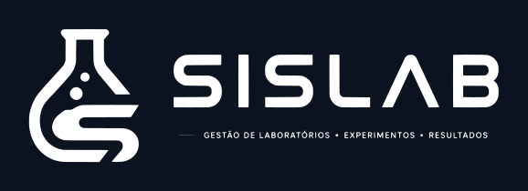
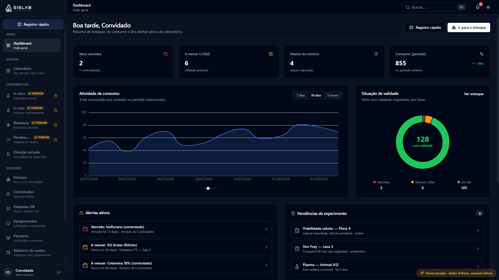
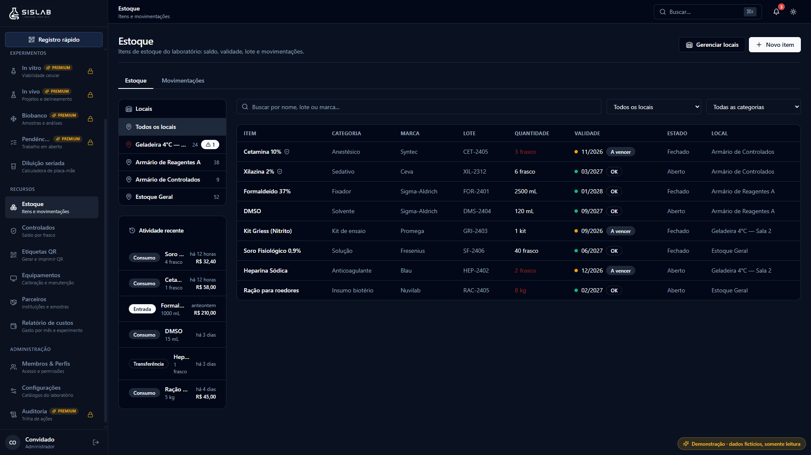
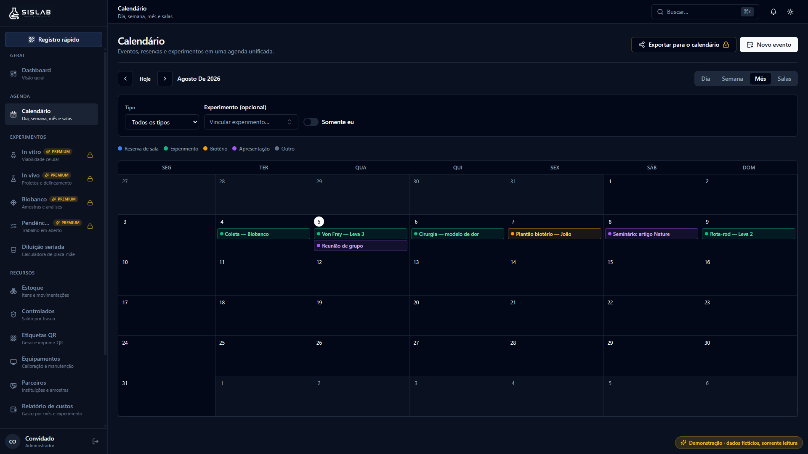
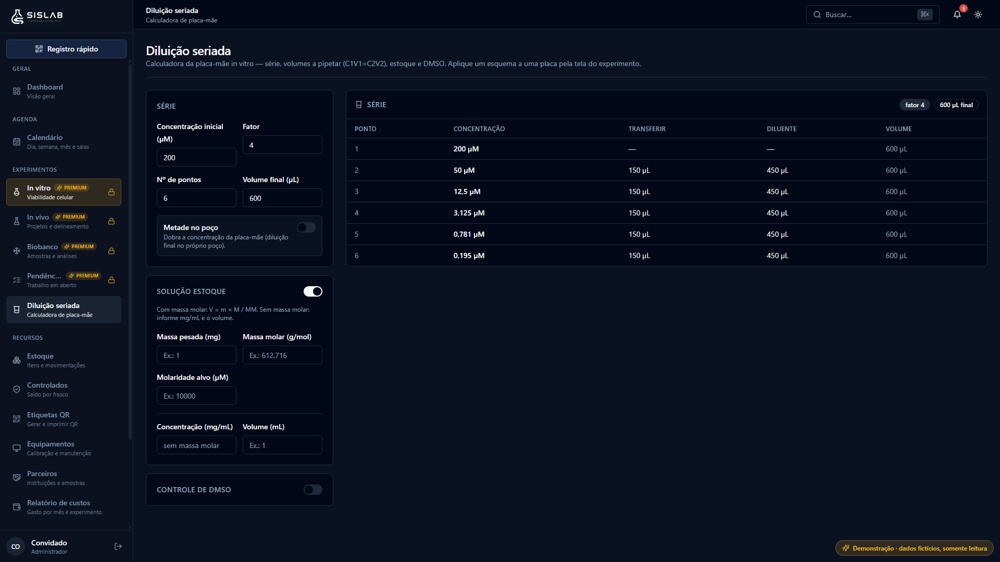
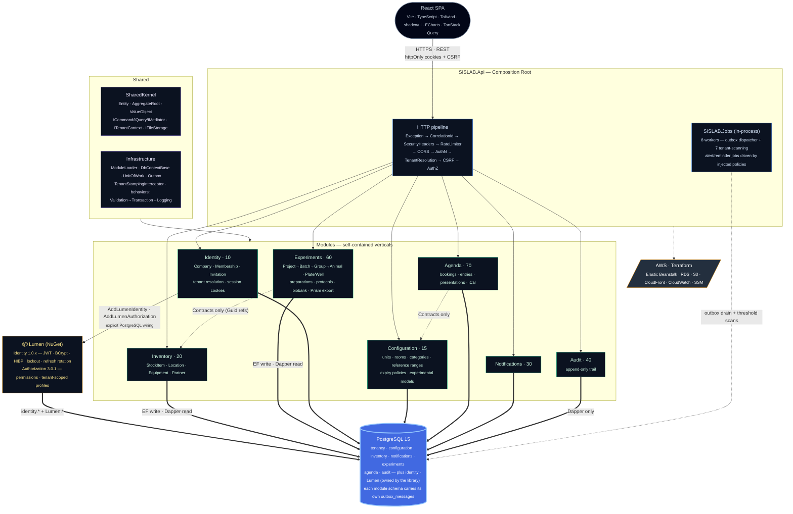

<p align="center">
  
</p>

<p align="center">
  <i>Multi-tenant <b>laboratory information management system</b> for a real pharmacology research lab<br/>
  — .NET 8 modular monolith (DDD · CQRS · Outbox) across 7 bounded contexts, IAM consumed as a<br/>
  NuGet library, a React SPA, and the lab's own bench calculations encoded as domain logic.</i>
</p>

<p align="center">
  <a href="https://github.com/KauaVilasBoas/SISLAB/releases/latest">
    
  </a>
  <a href="https://github.com/KauaVilasBoas/SISLAB/actions/workflows/ci.yml">
    
  </a>
  
  
  
  
  <a href="https://www.conventionalcommits.org/">
    
  </a>
  <a href="LICENSE">
    
  </a>
</p>

<p align="center">
  <b>7</b> bounded contexts &nbsp;·&nbsp; <b>~1.1k</b> tests &nbsp;·&nbsp; <b>69</b> architecture rules &nbsp;·&nbsp; <b>9</b> schemas &nbsp;·&nbsp; <b>24</b> SPA screens
</p>

<p align="center">
  <a href="#what-is-this">Why</a> &nbsp;·&nbsp;
  <a href="#the-domain-encoded">Domain</a> &nbsp;·&nbsp;
  <a href="#architecture-at-a-glance">Architecture</a> &nbsp;·&nbsp;
  <a href="#engineering-decisions">Decisions</a> &nbsp;·&nbsp;
  <a href="#getting-started">Run it</a> &nbsp;·&nbsp;
  <a href="#roadmap">Roadmap</a>
</p>

---

## What is this?

A pharmacology research lab ran its entire operation on Google Sheets: inventory, animal study
designs, plate layouts, dose calculations, collection sheets, room bookings. The spreadsheets worked
— they also meant no stock level anyone could trust, no expiry alerts, no audit trail, no concurrent
editing, and **every dose and dilution recalculated by hand, per experiment, with a calculator.**

**SISLAB replaces that.** Not as a CRUD over the same columns — the interesting part was reading the
spreadsheets closely enough to find where the actual work was, and moving *that* into the domain
model:

> A 2 g/kg group averaging 200 g needs 0.400 g of compound; at density 0.95 g/mL that's 421.1 µL of
> compound; at a 1 g : 5 µL ratio the final solution must reach 1000 µL; so **578.9 µL of diluent**.
>
> <sub>Illustrative figures — the real dose, density and diluent belong to the client's unpublished
> protocol and live in their database, not in this repository.</sub>

That calculation was done by hand for every group of every study. It's now
`InVivoPreparationCalculator` — with the density, the g:µL ratio and the diluent as **per-lab
configuration**, never as constants in C#. Same for serial dilutions, plate controls, Von Frey
up-down thresholds and the Griess curve.

The pilot client is **LAFTE**, a real laboratory. Multi-tenancy was designed in from the first
commit: one installation serves many labs in complete data isolation, and nothing specific to LAFTE
is hardcoded anywhere.

Identity and access management are delegated to **[Lumen](https://github.com/KauaVilasBoas/Lumen)**
— a permission-based IAM library I built and publish to NuGet, consumed here as
`Lumen.Identity 1.0.x` + `Lumen.Authorization 3.0.1`. SISLAB drove two of its features to release:
tenant-scoped permissions and the PostgreSQL provider.

### Highlights

- **The lab's math is domain logic, not a spreadsheet** — in vivo dose preparation (weight ·
  density · g:µL ratio · diluent), in vitro serial dilution (`V = m·M/MM`, `C₁V₁ = C₂V₂`, configurable
  dilution factor, DMSO), Von Frey up-down (Dixon/Chaplan), cell viability %, nitric oxide via Griess
  curve — all unit-tested, all parameterised per laboratory.
- **Multi-tenancy in depth** — the active company lives in an httpOnly cookie, *not* in the JWT, and
  is re-validated against `company_memberships` on every request. `companyId` flows cookie →
  middleware → `ITenantContext` → EF Core global query filter → `WHERE company_id` in every Dapper
  query. The cookie alone is never trusted.
- **7 modules, boundaries enforced by the build** — 69 ArchUnitNET facts fail `dotnet test` the moment
  a module reaches into another module's internals. Only `*.Contracts` assemblies may cross a
  boundary, and Domain may not reference EF Core, Dapper or ASP.NET.
- **Dual persistence, right tool per side** — EF Core owns writes (aggregates, invariants,
  transactions, soft delete, tenant stamping); Dapper owns reads with raw PostgreSQL SQL, query +
  handler + result sealed in a single file. No ORM overhead on dashboards and reports.
- **Hybrid event strategy** — events that *are* business invariants dispatch in-transaction (failure
  rolls back); cross-module side effects are written to the module's own `outbox_messages` table in
  the same transaction and delivered eventually by the dispatcher. No distributed transactions,
  at-least-once delivery.
- **Schema per bounded context** — `tenancy.*`, `configuration.*`, `inventory.*`, `notifications.*`,
  `experiments.*`, `agenda.*`, `audit.*` are SISLAB's; `identity.*` and `Lumen.*` belong to the IAM
  library. Each context owns its migrations, applied at boot. No cross-schema foreign keys —
  cross-references are `Guid` values, so extracting a module later stays cheap.
- **Production hardening, not a demo** — httpOnly cookie auth + CSRF, per-IP rate limiting, security
  headers, RFC 7807 ProblemDetails, correlation ids, Serilog structured logging to Coralogix, and an
  append-only audit trail with CSV export.

---

## Editions

The product is presented in two tiers, and the public build makes the split visible.

- **Core** — fully open and navigable: the dashboard, **Inventory**, **Agenda**, **Configuration**,
  labels, and the **serial-dilution calculator**.
- **Premium** — the advanced research suite: **Experiments** (in vivo design, plates, biobank,
  collection) and the **Audit trail**, plus **calendar export** (iCal for Google / Outlook / Apple
  Calendar). In the public build these render an immersive locked showcase — `PremiumModuleGate` for a
  whole module, `PremiumFeatureButton` for a single action — instead of the working screen.

Every module's backend is implemented and covered by tests (see the [Roadmap](#roadmap)); the gating
is a deliberate product-tier decision in the SPA, not a stub. Premium modules are marked **†** in the
Modules table below.

---

## Screenshots



| Inventory | Agenda |
|---|---|
|  |  |



<sub>Captured from the public read-only demo — fictional data, nothing from the real pilot lab.</sub>

---

## Modules

Seven bounded contexts, each a self-contained vertical (`Domain` · `Application` ·
`Infrastructure` · `Contracts`) loaded by `ModuleLoader` in a deterministic order.

| # | Module | Owns |
|---|---|---|
| 10 | **Identity** | `Company`, `CompanyMembership`, `CompanyInvitation`; tenant resolution middleware; the httpOnly session + active-company cookies; the bridge into Lumen |
| 15 | **Configuration** | Per-laboratory parameterisation — units, rooms, item categories, reference ranges, collection roles, inclusion criteria, expiry policies, experimental models. This is what keeps LAFTE's reality out of the code |
| 20 | **Inventory** | `StockItem` (batches, allocations, container state), `StorageLocation`, `Equipment` (calibration schedules, maintenance records), `Partner`; consumption, transfers, stock counts, disposal, cost & consumption reports |
| 30 | **Notifications** | `Notification` aggregate + publisher — in-app delivery for every alert the jobs raise |
| 40 | **Audit** † | Append-only `audit.audit_entries` (Dapper-only, write-once, no EF context), tenant-scoped listing and CSV export |
| 60 | **Experiments** † | `Project → Batch → Group → Animal` in vivo designs; `Plate`/`Well` in vitro layouts; preparation calculators; protocols (Von Frey, Tail Flick, Rota Rod, hemogram, cell viability, nitric oxide); `CollectionPlan`; `Sample` biobank + analyses; evidence attachments; GraphPad Prism export; schedule generation with responsible-roster rotation |
| 70 | **Agenda** | Room bookings, agenda entries, seminar presentations, bioterium assignments, and iCal subscription feeds |

<sub>† <b>Premium tier</b> — see [Editions](#editions). The serial-dilution calculator (under Experiments) stays in Core and remains fully navigable.</sub>

---

## Architecture at a glance


```mermaid
flowchart TB
    SPA(["React SPA<br/><sub>Vite · TypeScript · Tailwind · shadcn/ui · ECharts · TanStack Query</sub>"])

    subgraph HOST["SISLAB.Api — Composition Root"]
        PIPE["HTTP pipeline<br/><sub>Exception → CorrelationId → SecurityHeaders → RateLimiter<br/>→ CORS → AuthN → TenantResolution → CSRF → AuthZ</sub>"]
        JOBS["SISLAB.Jobs (in-process)<br/><sub>8 workers — outbox dispatcher + 7 tenant-scanning<br/>alert/reminder jobs driven by injected policies</sub>"]
    end

    subgraph MODS["Modules — self-contained verticals"]
        IDN["Identity · 10<br/><sub>Company · Membership · Invitation<br/>tenant resolution · session cookies</sub>"]
        CFG["Configuration · 15<br/><sub>units · rooms · categories · reference ranges<br/>expiry policies · experimental models</sub>"]
        INV["Inventory · 20<br/><sub>StockItem · Location · Equipment · Partner</sub>"]
        NTF["Notifications · 30"]
        AUD["Audit · 40<br/><sub>append-only trail</sub>"]
        EXP["Experiments · 60<br/><sub>Project→Batch→Group→Animal · Plate/Well<br/>preparations · protocols · biobank · Prism export</sub>"]
        AGD["Agenda · 70<br/><sub>bookings · entries · presentations · iCal</sub>"]
    end

    subgraph SHARED["Shared"]
        SK["SharedKernel<br/><sub>Entity · AggregateRoot · ValueObject<br/>ICommand/IQuery/IMediator · ITenantContext · IFileStorage</sub>"]
        INFRA["Infrastructure<br/><sub>ModuleLoader · DbContextBase · UnitOfWork · Outbox<br/>TenantStampingInterceptor · behaviors: Validation→Transaction→Logging</sub>"]
    end

    LUM["📦 Lumen (NuGet)<br/><sub>Identity 1.0.x — JWT · BCrypt · HIBP · lockout · refresh rotation<br/>Authorization 3.0.1 — permissions · tenant-scoped profiles</sub>"]

    DB[("PostgreSQL 15<br/><sub>tenancy · configuration · inventory · notifications · experiments<br/>agenda · audit — plus identity · Lumen (owned by the library)<br/>each module schema carries its own outbox_messages</sub>")]

    AWS[/"AWS · Terraform<br/><sub>Elastic Beanstalk · RDS · S3 · CloudFront · CloudWatch · SSM</sub>"/]

    SPA -- "HTTPS · REST<br/>httpOnly cookies + CSRF" --> PIPE

    PIPE --> IDN & CFG & INV & NTF & AUD & EXP & AGD

    IDN -- "AddLumenIdentity · AddLumenAuthorization<br/><sub>explicit PostgreSQL wiring</sub>" --> LUM

    LUM ==> |"identity.* + Lumen.*"| DB
    INV == "EF write · Dapper read" ==> DB
    EXP == "EF write · Dapper read" ==> DB
    IDN ==> DB
    CFG ==> DB
    AGD ==> DB
    NTF ==> DB
    AUD == "Dapper only" ==> DB

    JOBS -. "outbox drain + threshold scans" .-> DB
    EXP -. "Contracts only (Guid refs)" .-> INV
    AGD -. "Contracts only" .-> CFG

    SHARED --> MODS

    HOST -.-> AWS

    classDef host     fill:#0b1220,stroke:#3b82f6,color:#dbeafe
    classDef module   fill:#0b1220,stroke:#10b981,color:#d1fae5
    classDef shared   fill:#0b1220,stroke:#a78bfa,color:#ede9fe
    classDef lumen    fill:#0b1220,stroke:#f59e0b,color:#fde68a
    classDef external fill:#020617,stroke:#64748b,color:#cbd5e1
    classDef db       fill:#4169E1,stroke:#93c5fd,color:#ffffff,stroke-width:3px
    classDef aws      fill:#232F3E,stroke:#FF9900,color:#ffffff

    class PIPE,JOBS host
    class IDN,CFG,INV,NTF,AUD,EXP,AGD module
    class SK,INFRA shared
    class LUM lumen
    class SPA external
    class DB db
    class AWS aws
```

<sub><b>Reading the diagram</b> — the host composes modules by assembly scan (<code>ModuleLoader</code>, ordered by <code>IModule.Order</code>); thick arrows are EF Core / Dapper I/O; dashed arrows are contract dependencies and background access. Modules (green) never see each other's internals — only <code>*.Contracts</code>, and only by <code>Guid</code> value. Lumen (amber) owns the IAM schemas entirely; SISLAB never reads them directly. <code>tenancy.*</code> is SISLAB's own multi-tenancy schema, kept separate from Lumen's <code>identity.*</code> to avoid DbContext collisions.</sub>

---

## The domain, encoded

The part of this project I'd point at first. Every number below came out of a spreadsheet cell and
is now tested code with the lab-specific values held in `Configuration`.

<details open>
<summary><b>In vivo — dose preparation by body weight</b></summary>

`Domain/Preparations/InVivoPreparationCalculator.cs`. Given a group's mean weight, a target dose in
g/kg, the compound's density and state, and the lab's g:µL ratio, it derives compound mass →
compound volume → final solution volume → **diluent volume**. The control group receives vehicle
only, with no subtraction. Density, ratio and diluent are configuration; the *shape* of the
calculation is the domain.

</details>

<details>
<summary><b>In vitro — stock solutions and serial dilution schemes</b></summary>

`Domain/Preparations/SerialDilutionCalculator.cs`, `StockSolution.cs`, `DmsoDilution.cs`.
`V = m·M/MM` for molar compounds, mg/mL when there is no molar mass, `C₁V₁ = C₂V₂` per step,
configurable dilution factor and point count, configurable mother-plate volume (with a separate
volume for oil compounds in Eppendorf), and DMSO handling. The concrete factors, volumes and
concentration ranges are per-laboratory configuration, not code.

</details>

<details>
<summary><b>Plates, wells and controls</b></summary>

`Domain/Plates/{Plate,Well,WellRole}.cs`. A plate layout with typed well roles, so per-plate
controls (DEXA, CTRL+ = LPS+INF, CTRL−, CITO) are modelled instead of remembered.

</details>

<details>
<summary><b>Protocols as strategies</b></summary>

`Application/Protocols/` — `IExperimentProtocol` resolved by `ExperimentProtocolResolver`, with
`VonFreyUpDownCalculationStrategy` (full Dixon/Chaplan up-down 50 % threshold),
`ViabilityCalculationStrategy`, `NitricOxideCalculationStrategy` (Griess curve) and
`ReplicateStatistics`. Adding a new assay means adding a strategy, not touching a switch.

</details>

<details>
<summary><b>Schedules and collection sheets</b></summary>

`Domain/Scheduling/ExperimentScheduleGenerator.cs` builds the study timeline from the bound
experimental model and rotates responsibilities through a `ResponsibleRoster`.
`Domain/Collection/CollectionPlan.cs` encodes the collection sheet: roles (float, anaesthesia,
decapitation, blood, marrow, ganglion, nerve) assigned to people, and the sample → analysis →
storage matrix that ends in the `Sample` biobank with evidence attachments.

</details>

---

## Engineering decisions

Every decision started as a card on the [Trello board](https://trello.com/b/C8qhOb3j/sislab).

| Decision | Rationale |
|---|---|
| **Nothing lab-specific in code** | Densities, g:µL ratios, diluents, dilution factors, plate volumes, glycaemia thresholds, reference ranges, collection roles and the sample→analysis matrix are all rows in `configuration.*`. The pilot lab's numbers live in seed data and tests. This is the difference between a tool for LAFTE and a product. |
| **Active company in a cookie, not the JWT** | A claim is frozen at issue time, so switching labs would need a re-login. An httpOnly + SameSite cookie carries the active `companyId` and `TenantResolutionMiddleware` re-validates membership per request. Switching company = new cookie, same token. Cost: one extra read per request. |
| **httpOnly session cookies over Bearer-in-localStorage** | Lumen issues the JWT; SISLAB stores it in `sislab_access_token` (httpOnly, `/`) and the refresh token in `sislab_refresh_token` (httpOnly, pinned to `/api/auth/refresh`). A `JwtBearerEvents.OnMessageReceived` hook reads the cookie so the standard `UseAuthentication` pipeline is untouched. XSS cannot read the credential; CSRF is closed by antiforgery + `CsrfValidationMiddleware`. |
| **Pipeline order: AuthN → TenantResolution → AuthZ** | Tenant resolution needs the authenticated principal to look up membership, and must populate `ITenantScopeAccessor` *before* `UseAuthorization`, because Lumen's permission handler reads the scope during authorization. Wrong order = 403 on every tenant-scoped endpoint even with correct permissions. |
| **IAM as a NuGet library** | AuthN/AuthZ are delegated to [Lumen](https://github.com/KauaVilasBoas/Lumen): it owns users, tokens and profiles; SISLAB owns tenancy and the permission catalogue. A genuine bounded-context split — no shared schemas, no shared internals, `Guid` references only. Building both sides is what surfaced Lumen's tenant-scoped permissions and PostgreSQL provider. |
| **SISLAB owns the permission catalogue** | Lumen 3.0 seeds nothing by contract, so the catalogue is applied out-of-band by the `SISLAB.Migrations` project via the idempotent `SeedLumenPermissionGroup`/`SeedLumenPermission` helpers. A dedicated seed project — not a boot-time hosted service, not a module migration — keeps reference data off the app boot path and off the module schemas. There are **no permission-code constants in C#**: `[RequirePermission]` derives `Controller.Action` by convention and the DB rows are the single source of truth. |
| **Schema per bounded context** | Seven SISLAB schemas (`tenancy`, `configuration`, `inventory`, `notifications`, `experiments`, `agenda`, `audit`), each owned by exactly one `DbContext` — or, for Audit, a boot-time DDL script — with its own migration history applied at startup. Two more (`identity`, `Lumen`) belong entirely to the IAM library, plus a `seed` history for the catalogue project. No cross-schema foreign keys. Extraction cost stays low by construction. |
| **Dual persistence — EF write, Dapper read** | Invariants and transactional writes get change tracking, the tenant global query filter and the `TenantStampingInterceptor`. Dashboards, reports and paginated lists get raw PostgreSQL SQL with query, handler and result record sealed in one file. No ORM on the hot read path; no raw SQL on the mutation path. |
| **Hybrid event strategy** | Domain events that enforce an invariant dispatch inside the transaction — failure rolls the whole operation back. Integration events are written to the outbox in the same transaction and drained by `OutboxDispatcherJob`. At-least-once without distributed transactions. |
| **One outbox table per module schema** | Every module `DbContext` implements `IOutboxDbContext` and applies the *shared* `OutboxMessageConfiguration` under its own default schema — so `inventory.outbox_messages`, `experiments.outbox_messages`, and so on. A single central `outbox.*` table would have been a shared write point between otherwise isolated contexts: cross-module contention, one migration history owning everyone's table, and a schema no module could own. Per-module tables keep the transactional guarantee (the outbox write is in the *same* transaction as the aggregate) while the dispatcher stays generic. |
| **Audit has no DbContext** | The trail is write-once and read-only afterwards, so it's Dapper-only with an idempotent `CREATE ... IF NOT EXISTS` bootstrapper — the same "each module owns its schema at boot" convention, minus EF ceremony. Indexed for the only two read patterns that exist: newest-first per company, and narrowing by entity type. |
| **Jobs in-process with the API** | Eight scheduled workers (outbox drain, expiry, low stock, calibration overdue, controlled-substance compliance, agenda/bioterium/presentation reminders) run inside the API rather than as a separate host. Seven of them share a `CompanyScanAlertJob` base that iterates tenants and applies an injected alert policy, so a new alert is a policy class, not a new worker. One deploy unit at this scale; the extraction seam is `AddSislabJobs`. |
| **Architecture tests as a build gate** | 69 ArchUnitNET facts in `tests/SISLAB.ArchitectureTests`: module isolation, controller dependency direction, and `WriteEndpointAuthorizationTests`, which fails the build if any write endpoint loses its `[RequirePermission]`. Violations break the build, they don't wait for a review comment. |
| **AWS + Terraform IaC** | Elastic Beanstalk against RDS PostgreSQL, S3 + CloudFront for the SPA. All infrastructure is HCL under `infra/` (`modules/{network,compute,database,storage}` + `envs/staging`). Secrets in SSM Parameter Store, never in source. |

---

## Stack

| Layer | Technology |
|---|---|
| Runtime | .NET 8 / ASP.NET Core 8 |
| Architecture | Modular monolith — DDD + CQRS + Outbox, 7 bounded contexts |
| Write-side | EF Core 8 + PostgreSQL 15 (snake_case, schema-per-module, soft delete, tenant stamping) |
| Read-side | Dapper — raw SQL, query + handler + result in one file |
| IAM | [`Lumen.Identity`](https://www.nuget.org/packages/Lumen.Identity) 1.0.x + [`Lumen.Authorization`](https://www.nuget.org/packages/Lumen.Authorization) 3.0.1 (NuGet) |
| In-process messaging | Custom `IMediator` + `IEventBus`, behaviors: Validation → Transaction → Logging |
| Background jobs | 8 scheduled workers on a shared `TimedBackgroundService` — outbox dispatcher + policy-driven alerts |
| Frontend | React 18 + Vite 5 + TypeScript 5 + Tailwind + shadcn/ui + ECharts + TanStack Query + ZXing (barcode) + qrcode (labels) |
| Security | httpOnly cookie auth · antiforgery CSRF · per-IP rate limiting · security headers · HSTS · RFC 7807 |
| Observability | Serilog (JSON console + Coralogix HTTP sink) · correlation ids · health checks · append-only audit trail |
| Infrastructure | AWS — Elastic Beanstalk · RDS · S3 · CloudFront · CloudWatch · SSM |
| IaC | Terraform (HCL under `infra/`) |
| Testing | xUnit + ArchUnitNET + Testcontainers (real PostgreSQL), hand-written fakes over a mocking framework (`SISLAB.TestSupport`) — ~1,100 tests across 12 projects |

---

## Source tree

<details>
<summary>Layout</summary>

```
SISLAB/
├── src/
│   ├── Host/SISLAB.Api/              # Composition Root, pipeline, CSRF, rate limiting, Swagger
│   ├── Jobs/SISLAB.Jobs/             # 8 scheduled workers (outbox dispatcher + alert policies)
│   ├── Modules/
│   │   ├── Identity/                 # Domain · Application · Infrastructure · Contracts
│   │   ├── Configuration/            #   (every module follows the same 4-project shape;
│   │   ├── Inventory/                #    Audit has no Domain — the trail is Dapper-only)
│   │   ├── Notifications/
│   │   ├── Audit/
│   │   ├── Experiments/
│   │   └── Agenda/
│   ├── Shared/
│   │   ├── SISLAB.SharedKernel/      # Entity, AggregateRoot, ValueObject, CQRS + tenancy contracts
│   │   └── SISLAB.Infrastructure/    # ModuleLoader, DbContextBase, UoW, Outbox, behaviors, storage
│   └── SISLAB.Migrations/            # Out-of-band seed project (permission catalogue)
├── tests/                            # 12 test projects + SISLAB.TestSupport
│   └── SISLAB.ArchitectureTests/     # 69 ArchUnitNET boundary facts
├── frontend/                         # React SPA — 13 feature modules, 24 pages
└── infra/                            # Terraform: modules/{network,compute,database,storage}, envs/staging
```

</details>

<details>
<summary>How modules are registered</summary>

Each module exposes exactly one `IModule` in its Application project:

```csharp
public sealed class IdentityModule : IModule
{
    public int Order => 10; // Identity 10 · Configuration 15 · Inventory 20 · Notifications 30
                            // Audit 40 · Experiments 60 · Agenda 70

    public void RegisterServices(IServiceCollection services, IConfiguration configuration)
    {
        services.AddIdentityModule(configuration);

        // The module's MVC controllers live in this assembly, co-located with the CQRS
        // queries they dispatch. Registering the ApplicationPart makes their
        // [RequirePermission] actions visible to Lumen's enforcement filter.
        services.AddControllers().AddApplicationPart(typeof(IdentityModule).Assembly);
        services.AddHandlersFromAssembly(typeof(IdentityModule).Assembly);
    }

    public void MapEndpoints(IEndpointRouteBuilder endpoints)
    {
        endpoints.MapSislabAuthEndpoints();      // replaces MapLumenIdentityEndpoints:
                                                 // same Lumen commands, cookie-bridged
        endpoints.MapActiveCompanyEndpoints();
    }
}
```

Identity is the only module that maps Minimal API endpoints — it has to, because the cookie bridge
replaces Lumen's own endpoint mapping. The other six expose attribute-routed MVC controllers and
leave `MapEndpoints` empty; `app.MapControllers()` picks them up once the module has registered its
`ApplicationPart`.

The host wires all seven with two calls — no per-module plumbing:

```csharp
ModuleLoader.RegisterModules(builder.Services, builder.Configuration, moduleAssemblies);
// ...
ModuleLoader.MapModuleEndpoints(app);
app.MapControllers();   // module MVC controllers, for Lumen's [RequirePermission] discovery
```

</details>

---

## API surface

| Area | Base route |
|---|---|
| Auth (Lumen + SISLAB cookie bridge) | `/api/auth/{register,login,refresh,logout,confirm-email,resend-confirmation,forgot-password,reset-password,change-password,permissions,csrf}` |
| Companies & tenancy | `/api/companies` · `/api/companies/mine` · `/api/companies/{id}/activate` · `/api/companies/active` · `/api/companies/invitations` |
| Company administration | `/api/admin/companies/active/members` · `.../members/{userId}/profiles` · `/api/admin/profiles` |
| Inventory | `/api/inventory/stock-items` · `stock-movements` · `storage-locations` · `equipment` · `partners` · `reports/cost-by-{month,experiment}` · `consumption-series` |
| Configuration | `/api/configuration/{units,rooms,item-categories,reference-ranges,collection-roles,inclusion-criteria,expiry-policy,experimental-models}` |
| Experiments | `/api/experiments` · `/api/experiments/{id}/schedule` · `/api/experiments/pendencies` · `/api/projects` · `/api/samples` · `/api/collection-plans` · `/api/attachments` |
| Agenda | `/api/agenda` (bookings, rooms, presentations, bioterium) · `/api/agenda/entries` · `/api/agenda/ical/subscribe` → `/api/agenda/calendar.ics` |
| Notifications · Audit | `/api/notifications` · `/api/audit` (list + CSV export) |
| Health | `GET /health` |

Write endpoints are `[RequirePermission]`-gated against the active company — enforced by
`WriteEndpointAuthorizationTests`, not by convention alone. Errors follow RFC 7807 with the request
correlation id as `traceId`.

```powershell
# Login — sets the httpOnly session cookies (no token in the response body for browsers)
curl -i -c cookies.txt -X POST http://localhost:5121/api/auth/login `
  -H "Content-Type: application/json" `
  -d '{"identifier":"admin@lafte.dev","password":"<password>"}'

# Activate a laboratory — sets sislab_active_company
curl -i -b cookies.txt -c cookies.txt -X POST `
  http://localhost:5121/api/companies/<companyId>/activate

# Tenant-scoped read
curl -b cookies.txt http://localhost:5121/api/inventory/stock-items?page=1
```

---

## Getting started

### Prerequisites

- .NET 8 SDK
- PostgreSQL 15 (local on `:5432`)
- Node 20+ (for the SPA)
- Docker (only to run the Testcontainers integration tests)

### Configure secrets

```powershell
cd src/Host/SISLAB.Api

# One connection string serves EF Core, Dapper and both Lumen packages
dotnet user-secrets set "ConnectionStrings:SislabDb" `
  "Host=localhost;Port=5432;Database=SISLAB_LOCALHOST;Username=postgres;Password=<password>"

dotnet user-secrets set "LumenIdentity:Jwt:Secret"   "<random-32-chars-min>"
dotnet user-secrets set "LumenIdentity:Jwt:Issuer"   "sislab-local"
dotnet user-secrets set "LumenIdentity:Jwt:Audience" "sislab-local"

# Dev seed — creates the LAFTE company + an email-confirmed admin with the Administrator profile
dotnet user-secrets set "Seed:Enabled"        "true"
dotnet user-secrets set "Seed:Admin:Email"    "admin@lafte.dev"
dotnet user-secrets set "Seed:Admin:Username" "lafte-admin"
dotnet user-secrets set "Seed:Admin:Password" "<strong-password-min-12>"
```

### Run

```powershell
dotnet run --project src/Host/SISLAB.Api    # API — hosted services apply every schema on boot
dotnet run --project src/SISLAB.Migrations  # seeds the permission catalogue (once per database)

cd frontend; npm install; npm run dev       # SPA on :5173, proxied to the API
```

- Swagger: `https://localhost:<port>/swagger` (development only)
- Health: `GET /health`

Full walkthrough — migration order, the auth + tenant flow, and known Lumen quirks — in
[DEV_SETUP.md](DEV_SETUP.md).

### Tests

```powershell
dotnet test                                 # ~1,100 tests (needs Docker — Testcontainers)
dotnet test tests/SISLAB.ArchitectureTests  # boundary enforcement only, no Docker needed
```

---

## Roadmap

| Epic | Focus | Status |
|---|---|---|
| **E0** Modular skeleton | Solution, SharedKernel, `IModule`/`ModuleLoader`, architecture tests | ✅ Shipped |
| **E1** Identity & tenancy | Lumen integration, `Company`, tenant resolution, tenant-scoped authz, invitations | ✅ Shipped |
| **E2** CQRS platform | `IMediator`, pipeline behaviors, domain events, Outbox, EF + Dapper wiring | ✅ Shipped |
| **E3** Inventory write | `StockItem`, `StorageLocation`, `Equipment`, `Partner` + command handlers | ✅ Shipped |
| **E4** Inventory read | Dapper query handlers, paginated read models, cost & consumption reports | ✅ Shipped |
| **E5** Contracts & integration | Cross-module contracts, integration events between contexts | ✅ Shipped |
| **E6** Jobs | Outbox dispatcher + expiry, low-stock, calibration, compliance and reminder workers | ✅ Shipped |
| **E7** React SPA | Auth flow, inventory, experiments, agenda, labels, ECharts dashboard | ✅ Shipped |
| **E9** Observability & security | Serilog + Coralogix, correlation ids, audit trail, rate limiting, CSRF, ProblemDetails | ✅ Shipped |
| **E-Prep** Preparation calculations | In vivo dose by weight; in vitro stock + serial dilution (SISLAB-01, 05) | ✅ Shipped |
| **E-InVivo** In vivo design & readings | Cages, post-induction selection, randomisation, schedule + roster (SISLAB-02, 03, 04, 10) | ✅ Shipped |
| **E-InVitro** Plates | Plate layout, wells, per-plate controls (SISLAB-06, 07) | ✅ Shipped |
| **E-Coleta** Collection & biobank | Collection sheet, sample→analysis matrix, evidence attachments (SISLAB-08, 09) | ✅ Shipped |
| **E8** AWS & CI/CD | Terraform modules + staging env done; GitHub Actions builds, tests and validates the HCL on every push — **automated deploy still pending** | 🚧 In progress |
| Integration tests on real PostgreSQL | Testcontainers already cover Inventory and Notifications; extending to the remaining five modules | 🚧 In progress |
| S3-backed attachment storage | `IFileStorage` is abstracted; only `LocalFileStorage` exists today | Planned |
| `v1.0.0` release | Cut once E8 lands and the pilot lab is live in production | Planned |

The current version is [**`v0.9.0`**](https://github.com/KauaVilasBoas/SISLAB/releases/tag/v0.9.0) —
the seven bounded contexts are implemented and the three core pillars (Inventory, Experiments,
Agenda) are feature-complete. It stays on `0.x` deliberately: `1.0.0` is reserved for the day the
system runs in production at the pilot lab, so until then no stability guarantee is made about the
HTTP surface or the database schema.

Full backlog with acceptance criteria per card is on the
[Trello board](https://trello.com/b/C8qhOb3j/sislab).

---

## Engineering workflow

- **Task-first** — no branch without a Trello card; no card without acceptance criteria.
- **[Conventional Commits](https://www.conventionalcommits.org/)** — atomic commits on feature
  branches (`feat/…`, `fix/…`, `refactor/…`); `main` only moves by merge.
- **[SemVer](https://semver.org/)** — the first tagged release ships when the pilot laboratory goes
  live on AWS.
- **Boundaries are tested, not documented** — `dotnet test` is the architecture review.
- **`TreatWarningsAsErrors`** across the solution via `Directory.Build.props`.
- **CI on every push and pull request** —
  [`.github/workflows/ci.yml`](.github/workflows/ci.yml) builds the solution in `Release`, runs the
  architecture suite first as a fast fail, then the full test suite (Testcontainers spins up a real
  `postgres:16-alpine` on the runner), lints and builds the SPA, and checks Terraform formatting and
  validity.

---

## Documentation

| Document | Contents |
|---|---|
| [DEV_SETUP.md](DEV_SETUP.md) | Local dev guide: secrets, migration order, auth + tenant walkthrough, Lumen quirks |
| [infra/README.md](infra/README.md) | Terraform usage, environments, variables, deployment |
| [Trello board](https://trello.com/b/C8qhOb3j/sislab) | Live backlog with acceptance criteria per card |
| [Lumen](https://github.com/KauaVilasBoas/Lumen) | The IAM library SISLAB consumes — built and published alongside it |

---

## Author

**Kauã Vilas Boas** — Backend / Full-Stack Developer (.NET · C#)

<p>
  <a href="https://www.linkedin.com/in/kauavilasboas/">
    
  </a>
  <a href="https://github.com/KauaVilasBoas">
    
  </a>
  <a href="https://www.nuget.org/profiles/kauavilasboas">
    
  </a>
  <a href="mailto:kauacaldeira@hotmail.com">
    
  </a>
</p>

Based in Brazil (UTC−3) — full overlap with US East Coast and European afternoon working hours.
Open to remote opportunities.

---

## License

[MIT](LICENSE)
